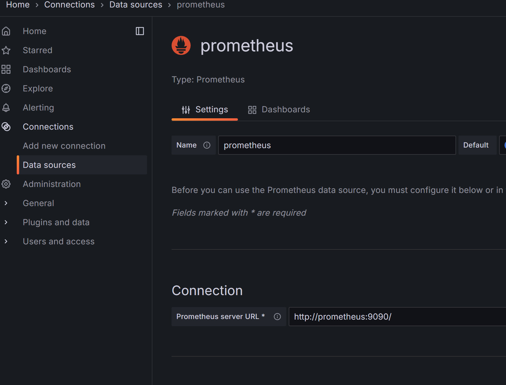

# Java Maven Project Generator

This command line tool helps you create a new Java Maven project with a specified Group ID and Artifact ID. It generates the necessary project structure, including the `pom.xml` file and a sample `Test.java` file with a 'Hello, World!' program.


## 

```bash

curl http://localhost:8080/actuator/prometheus | grep custom_request
```


## How to use

